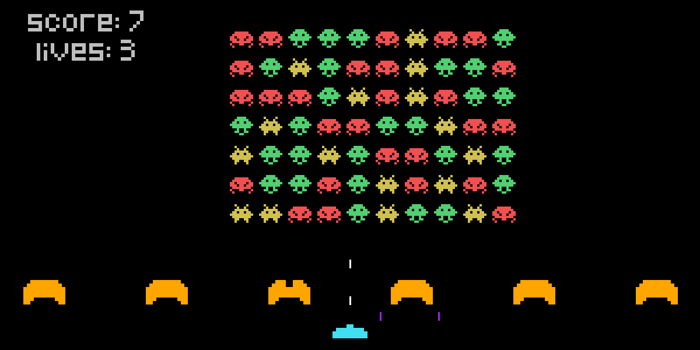

# Space Invaders

A recreation of the 1978 arcade classic, built from scratch in Python with pygame-ce.

A grid of aliens marches across the screen, dropping closer with every bounce off the edge. You
hold the bottom of the screen behind four destructible bunkers, and both sides can shoot through
them. The bunkers erode block by block as the fight goes on.



---

## Gameplay

| Action | Key |
| --- | --- |
| Move left / right | `←` `→` |
| Shoot | `Space` |
| Restart after losing | `Esc` |

- You start with **3 lives**. Each alien projectile that reaches you costs one.
- **+1 point** per alien destroyed.
- Your shots and the aliens' shots can cancel each other out mid-air.
- Bunkers block both sides, and every hit destroys one block of the bunker permanently.

## Running it

Requires Python 3.11 or newer.

```bash
pip install -r requirements.txt
```

```bash
python main.py
```

Run from the project root — assets are loaded from paths relative to the working directory.

## Project structure

| File | Responsibility |
| --- | --- |
| `main.py` | `Game` class: the main loop, collision handling, alien formation movement, scoring and HUD |
| `player.py` | `Player` sprite: input, screen-edge clamping, shooting with a fire-rate cooldown |
| `alien.py` | `Alien` sprite: loads one of three coloured invader graphics |
| `projectile.py` | `Projectile` sprite: shared by both sides, direction decided by its `type` |
| `obstacle.py` | `Block` sprite plus the ASCII `shape` map that bunkers are built from |
| `settings.py` | Screen dimensions |

## How it is built

**Everything is a sprite in a group.** pygame's `Group` handles drawing and updating in bulk, and
`groupcollide` does the collision checks between whole groups at once — player shots against
aliens, alien shots against bunkers, and shots against each other.

**Bunkers are drawn from text.** `obstacle.py` holds the bunker as a list of strings, and every
`x` becomes one small square sprite. This makes the bunkers erode realistically for free: a hit
removes a single block, not the whole structure.

```python
shape = [
    '  xxxxxxxx  ',
    ' xxxxxxxxxx ',
    'xxxxxxxxxxxx',
    'xxxxxxxxxxxx',
    'xxxxxxxxxxxx',
    'xxx      xxx',
    'xx        xx'
]
```

**The alien formation moves as one body.** Every frame the whole grid shifts sideways. Only when
the outermost alien touches a screen edge does the formation reverse and drop 10 pixels. The
edge test runs once per frame after all aliens have moved, so a single bounce produces a single
drop.

**Firing is rate-limited by a frame counter** rather than a timer, and alien fire is driven by a
`pygame.USEREVENT` timer that goes off once per second.

## Built with

- Python 3.11
- [pygame-ce](https://pyga.me/) 2.5.5
